# 🅿️ Multi-Threaded Parking Management System

A robust, concurrent parking management system built with Java, featuring thread-safe operations, real-time spot allocation, and automated payment processing.


## 📋 Table of Contents

- [Overview](#overview)
- [Features](#features)
- [Architecture](##architecture)
- [Concurrency & Synchronization](#concurrency--synchronization)
- [Database Schema](#database-schema)
- [Getting Started](#getting-started)
- [Usage Examples](#usage-examples)
- [Project Structure](#project-structure)
- [Threading Model](#threading-model)
- [API Documentation](#api-documentation)
- [Configuration](#configuration)
- [Contributing](#contributing)
- [License](#license)

## 🎯 Overview

This parking management system simulates a real-world multi-level parking facility with concurrent vehicle entry/exit operations. The system handles multiple cars simultaneously, manages spot allocation, processes payments, and maintains real-time availability tracking.

### Key Highlights

- **Thread-Safe Operations**: All critical sections are protected using semaphores, locks, and synchronized blocks
- **Real-Time Processing**: Concurrent handling of entry/exit gates with realistic simulation
- **Smart Allocation**: Automated spot allocation by vehicle type (VIP/REGULAR)
- **Payment Processing**: ReentrantLock-based payment system with timeout handling
- **Queue Management**: Wait/notify mechanism for handling parking capacity

## ✨ Features

### Core Functionality

- ✅ **Multi-Gate Entry/Exit**: 2 concurrent entry gates and 2 exit gates using semaphores
- ✅ **Spot Management**: Automatic allocation and deallocation of parking spots
- ✅ **Payment Processing**: Calculate fees based on duration with support for multiple payment methods
- ✅ **Real-Time Availability**: Callable tasks for checking available spots by type
- ✅ **Revenue Tracking**: Real-time revenue calculation and reporting
- ✅ **Capacity Management**: Queue system with wait/notify for full parking scenarios

### Concurrency Features

- 🔒 **Semaphore-based Gate Control**: Limits concurrent access to entry/exit gates
- 🔒 **ReentrantLock Payment Processing**: Non-blocking payment operations with timeout
- 🔒 **Synchronized Spot Allocation**: Thread-safe spot assignment
- 🔒 **Monitor-based Queue**: Wait/notify pattern for parking capacity management

## 🏗️ Architecture

The system follows a layered architecture:

```
┌─────────────────────────────────────────┐
│         Thread Layer (Runnable)         │
│  CarEntryTask | CarExitTask | Callables │
└─────────────────┬───────────────────────┘
                  │
┌─────────────────▼───────────────────────┐
│      Synchronization Layer              │
│  EntryGate | ExitGate | Queue | Locks   │
└─────────────────┬───────────────────────┘
                  │
┌─────────────────▼───────────────────────┐
│         Service Layer                   │
│  ParkingService | PaymentService        │
└─────────────────┬───────────────────────┘
                  │
┌─────────────────▼───────────────────────┐
│          DAO Layer                      │
│  Car | Spot | Ticket | Payment DAOs     │
└─────────────────┬───────────────────────┘
                  │
┌─────────────────▼───────────────────────┐
│         Database (MySQL)                │
└─────────────────────────────────────────┘
```

## 🔐 Concurrency & Synchronization

### 1. Entry Gate Controller
```java
private Semaphore gates = new Semaphore(2);
```
- Controls access to 2 physical entry gates
- Simulates 2-second gate passage time
- Prevents gate congestion

### 2. Exit Gate Controller
```java
private Semaphore exitGates = new Semaphore(2);
```
- Manages 2 exit gates independently
- Ensures orderly exit processing

### 3. Parking Queue
```java
public synchronized void waitForSpot()
public synchronized void spotFreed()
```
- Monitor-based synchronization using wait/notify
- Tracks occupied vs. total spots
- Blocks threads when parking is full

### 4. Payment Processor
```java
private static ReentrantLock lock = new ReentrantLock();
public Payment processPayment(...) {
    if(lock.tryLock(5, TimeUnit.SECONDS)) { ... }
}
```
- Non-blocking payment processing
- 5-second timeout to prevent deadlock
- Prevents concurrent payment corruption

### 5. Spot Allocator
```java
public synchronized Spot allocateSpot(String type)
```
- Atomic spot allocation
- Prevents double-booking
- Updates database status atomically

## 💾 Database Schema

### Tables

**Car**
- `idCar` (PK, AUTO_INCREMENT)
- `plateNumber` (VARCHAR, UNIQUE)
- `color` (VARCHAR)

**Parking**
- `idParking` (PK, AUTO_INCREMENT)
- `name` (VARCHAR)
- `location` (VARCHAR)

**Floor**
- `idFloor` (PK, AUTO_INCREMENT)
- `floorNumber` (INT)
- `idParking` (FK → Parking)

**Spot**
- `idSpot` (PK, AUTO_INCREMENT)
- `spotNumber` (VARCHAR)
- `status` (ENUM: 'FREE', 'OCCUPIED')
- `type` (ENUM: 'REGULAR', 'VIP')
- `idFloor` (FK → Floor)

**Ticket**
- `idTicket` (PK, AUTO_INCREMENT)
- `entryTime` (TIMESTAMP)
- `spotType` (VARCHAR)
- `idCar` (FK → Car)
- `idSpot` (FK → Spot)

**Payment**
- `idPayment` (PK, AUTO_INCREMENT)
- `amount` (DECIMAL)
- `paymentTime` (TIMESTAMP)
- `paymentMethod` (VARCHAR)
- `idTicket` (FK → Ticket)

## 🚀 Getting Started

### Prerequisites

- Java 17 or higher
- MySQL 8.0+
- Maven or Gradle (optional)
- JDBC Driver for MySQL

### Installation

1. **Clone the repository**
```bash
git clone https://github.com/yourusername/parking-management-system.git
cd parking-management-system
```

2. **Set up the database**
```sql
CREATE DATABASE parking_db;
USE parking_db;

-- Run the schema creation scripts
-- (Add your SQL schema files here)
```

3. **Configure database connection**
```java
// Update DatabaseConnection.java with your credentials
private static final String URL = "jdbc:mysql://localhost:3306/parking_db";
private static final String USER = "your_username";
private static final String PASSWORD = "your_password";
```

4. **Compile and run**
```bash
javac -d bin src/com/najim/**/*.java
java -cp bin com.najim.Main
```

## 📖 Usage Examples

### Simulating Car Entry

```java
ExecutorService executor = Executors.newFixedThreadPool(10);

// Simulate multiple cars entering
executor.submit(new CarEntryTask("ABC-123", "Red", "REGULAR"));
executor.submit(new CarEntryTask("XYZ-789", "Blue", "VIP"));
executor.submit(new CarEntryTask("LMN-456", "Black", "REGULAR"));
```

### Simulating Car Exit

```java
executor.submit(new CarExitTask("ABC-123", "CASH"));
executor.submit(new CarExitTask("XYZ-789", "CARD"));
```

### Checking Availability

```java
Future<Integer> availableSpots = executor.submit(new AvailabilityCheckerTask());
System.out.println("Available spots: " + availableSpots.get());

Future<List<Integer>> byType = executor.submit(new AvailabilityCheckerByTypeTask());
List<Integer> counts = byType.get();
System.out.println("VIP: " + counts.get(0) + ", REGULAR: " + counts.get(1));
```

### Calculating Revenue

```java
Future<Double> revenue = executor.submit(new RevenueCalculatorTask());
System.out.println("Total revenue: " + revenue.get() + " DH");
```

## 📁 Project Structure

```
src/
├── com/najim/
│   ├── Main.java                    # Application entry point
│   ├── connection/
│   │   └── DatabaseConnection.java
│   ├── model/
│   │   ├── Car.java
│   │   ├── Parking.java
│   │   ├── Floor.java
│   │   ├── Spot.java
│   │   ├── Ticket.java
│   │   └── Payment.java
│   ├── DAO/
│   │   ├── CarDAO.java
│   │   ├── ParkingDAO.java
│   │   ├── FloorDAO.java
│   │   ├── SpotDAO.java
│   │   ├── TicketDAO.java
│   │   └── PaymentDAO.java
│   ├── Service/
│   │   ├── ParkingService.java
│   │   └── PaymentService.java
│   ├── synchronization/
│   │   ├── EntryGateController.java
│   │   ├── ExitGateController.java
│   │   ├── ParkingQueue.java
│   │   ├── PaymentProcessor.java
│   │   └── SpotAllocator.java
│   └── threads/
│       ├── CarEntryTask.java
│       ├── CarExitTask.java
│       ├── AvailabilityCheckerTask.java
│       ├── AvailabilityCheckerByTypeTask.java
│       └── RevenueCalculatorTask.java
```

## 🧵 Threading Model

### Thread Pools

The system uses an ExecutorService thread pool to manage concurrent operations:

```java
ExecutorService executor = Executors.newFixedThreadPool(THREAD_POOL_SIZE);
```

### Task Types

1. **CarEntryTask** (Runnable)
   - Passes through entry gate (semaphore)
   - Waits for available spot (queue)
   - Allocates spot (synchronized)
   - Creates ticket

2. **CarExitTask** (Runnable)
   - Processes payment (ReentrantLock)
   - Frees spot (synchronized)
   - Notifies waiting cars (queue)
   - Passes through exit gate (semaphore)

3. **AvailabilityCheckerTask** (Callable<Integer>)
   - Returns count of free spots
   - Non-blocking read operation

4. **RevenueCalculatorTask** (Callable<Double>)
   - Calculates total revenue from database
   - Uses Stream API for aggregation

## 📚 API Documentation

### ParkingService

```java
// Park a car
Ticket parkCar(Car car, String type) throws Exception

// Exit a car and process payment
Payment exitCar(String plateNumber, String paymentMethod) throws Exception

// Find available spots
List<Spot> findAvailableSpots() throws Exception
List<Spot> findAvailableSpotsByType(String type) throws Exception

// Check if car is parked
boolean isCarCurrentlyParked(String plateNumber) throws Exception

// Get currently parked cars
List<Ticket> getCurrentlyParkedCars() throws Exception
```

### PaymentService

```java
// Calculate parking fee
double calculateFee(LocalDateTime entry, LocalDateTime exit)

// Revenue reporting
double getTotalRevenue() throws SQLException
double getRevenueByMethod(String method) throws SQLException
```

### Fee Structure

- **First hour**: 2.00 DH
- **Additional hours**: 1.50 DH per hour
- **Maximum daily**: 20.00 DH
- **Minimum charge**: 1.00 DH (< 30 minutes)
- **Rounding**: 30+ minutes rounds up to next hour

## ⚙️ Configuration

### Parking Capacity
```java
// In ParkingQueue.java
private static final int TOTAL_SPOTS = 60;
```

### Gate Configuration
```java
// Entry gates
private Semaphore gates = new Semaphore(2);

// Exit gates
private Semaphore exitGates = new Semaphore(2);
```

### Payment Timeout
```java
// In PaymentProcessor.java
lock.tryLock(5, TimeUnit.SECONDS)
```

### Gate Passage Time
```java
// Simulated gate passage
Thread.sleep(2000); // 2 seconds
```

## 🔍 Key Design Decisions

### Why Semaphores for Gates?
- Physical gates are limited resources (2 entry, 2 exit)
- Semaphores naturally model this constraint
- Prevents gate congestion

### Why ReentrantLock for Payments?
- `tryLock()` with timeout prevents indefinite blocking
- More flexible than synchronized blocks
- Better for high-contention scenarios

### Why Monitor Pattern for Queue?
- Classic producer-consumer problem
- Wait/notify provides efficient thread coordination
- No busy-waiting

### Why Synchronized for Spot Allocation?
- Simple, atomic operation
- Built-in monitor sufficient for this use case
- Prevents race conditions in spot assignment

## 🐛 Common Issues & Solutions

### Issue: "Parking FULL! Waiting for a spot..."
**Solution**: This is normal when all spots are occupied. The thread will wait until a spot is freed.

### Issue: "Payment processing timeout"
**Solution**: Increase timeout in PaymentProcessor or optimize database queries.

### Issue: Deadlock detection
**Solution**: The system uses timeout-based locks to prevent deadlocks. If you suspect deadlock, check:
- Lock acquisition order
- Timeout values
- Database transaction isolation levels

## 🧪 Testing

### Unit Tests
(Add your test cases here)

### Load Testing
Test with high concurrency:
```java
ExecutorService executor = Executors.newFixedThreadPool(50);
for (int i = 0; i < 100; i++) {
    executor.submit(new CarEntryTask(...));
}
```

## 🤝 Contributing

Contributions are welcome! Please follow these guidelines:

1. Fork the repository
2. Create a feature branch (`git checkout -b feature/AmazingFeature`)
3. Commit your changes (`git commit -m 'Add some AmazingFeature'`)
4. Push to the branch (`git push origin feature/AmazingFeature`)
5. Open a Pull Request

### Code Style
- Follow Java naming conventions
- Add JavaDoc comments for public methods
- Include unit tests for new features

## 📊 Architecture Diagrams

### Car Entry Flow
The complete flow from gate entry through parking queue management to spot allocation:

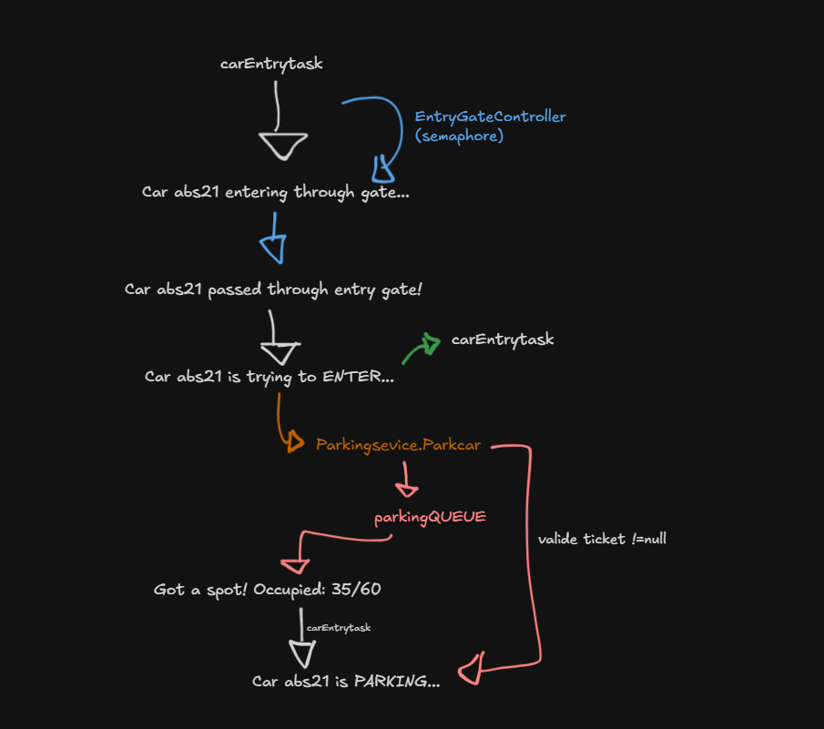

**Key Components:**
- **EntryGateController**: Semaphore-based gate access control (2 gates max)
- **ParkingQueue**: Monitor pattern with wait/notify for capacity management
- **ParkingService.parkCar()**: Validates car, checks for existing tickets, allocates spots
- **SpotAllocator**: Thread-safe synchronized spot allocation

---

### Car Exit Flow
Payment processing and spot release with synchronization:

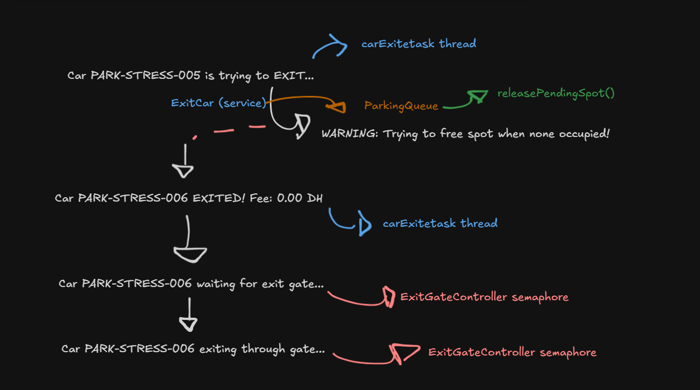

**Key Components:**
- **ExitCar Service**: Validates car and ticket existence
- **PaymentProcessor**: ReentrantLock with tryLock/unlock for thread-safe payment
- **ParkingQueue**: Notifies waiting threads when spot is freed
- **ExitGateController**: Semaphore-based exit gate management

---

### Park Car Service - Detailed Flow
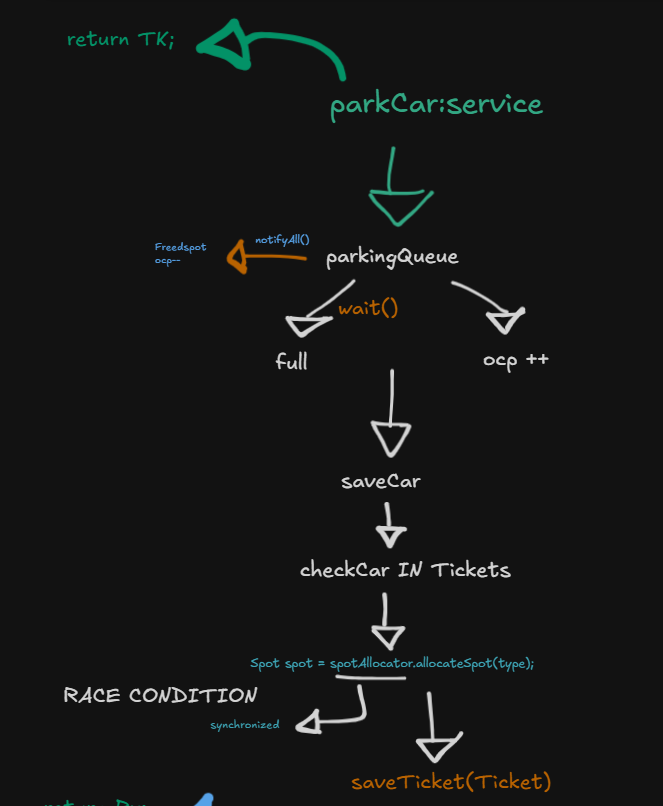

Shows the complete parkCar() method flow including:
- Queue waiting mechanism
- Car validation and duplicate check
- Synchronized spot allocation (race condition prevention)
- Ticket generation and database persistence

---

### Exit Car Service - Detailed Flow  
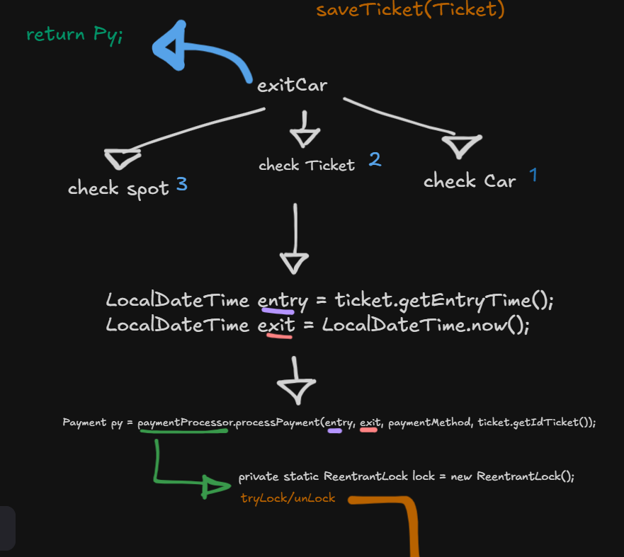

Complete exitCar() method showing:
1. Car lookup by plate number
2. Ticket validation
3. Spot status verification
4. Payment processing with ReentrantLock
5. Spot release and queue notification

---

### Payment Calculation Algorithm
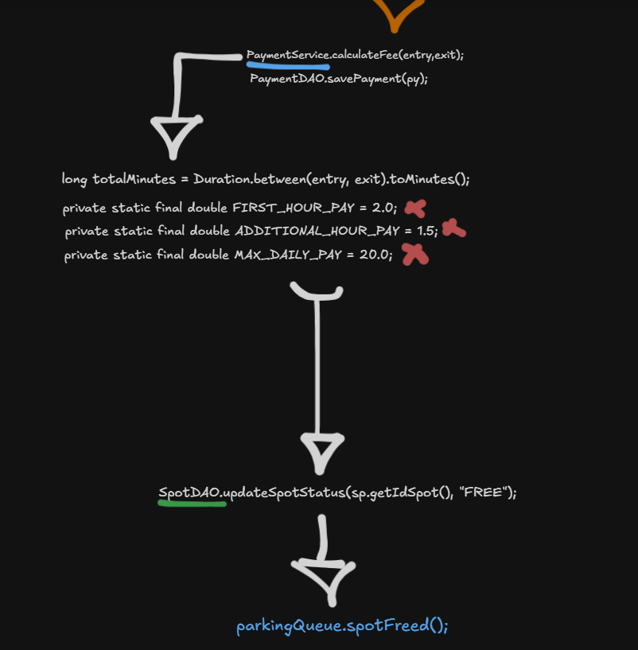

Fee structure implementation:
- Duration calculation using `Duration.between()`
- First hour: 2.00 DH
- Additional hours: 1.50 DH each
- Maximum daily cap: 20.00 DH
- 30+ minutes rounds up to next hour

---

### Availability Checker & Callable Tasks
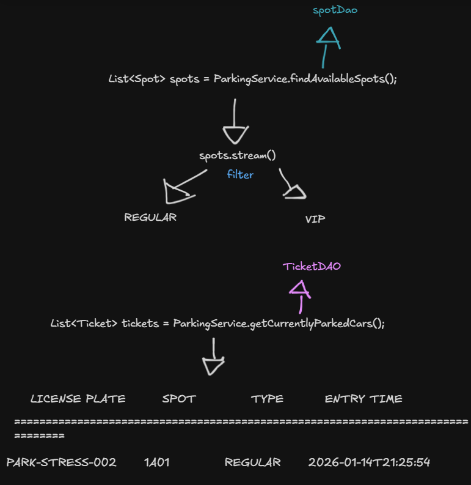

Demonstrates:
- Callable tasks returning availability counts
- Stream-based filtering by spot type (VIP/REGULAR)
- Thread-safe read operations from database

---

### Callable Tasks Pattern
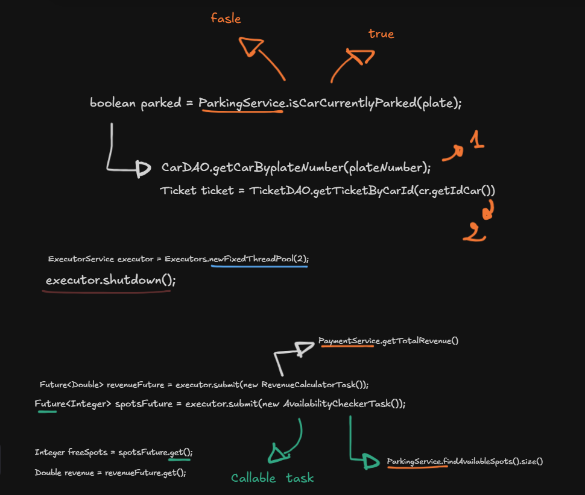

Shows the Future/Callable pattern for:
- Revenue calculation using Stream API
- Spot availability checking
- Non-blocking task execution with `executor.submit()`

---

### Statistics with Stream API
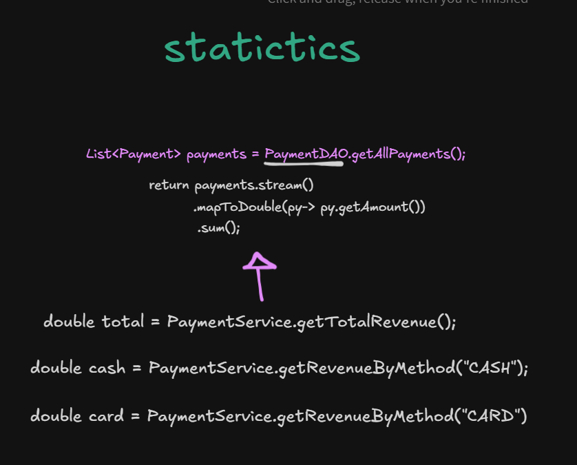

Revenue calculation using Java Streams:
```java
payments.stream()
    .mapToDouble(py -> py.getAmount())
    .sum()
```
Demonstrates functional programming for aggregations

---

## 🖥️ Console Interface

### Main Menu
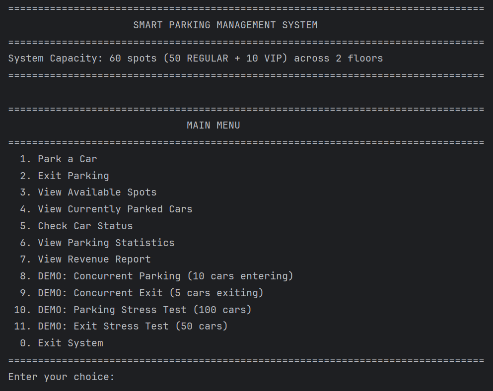

Features include:
- Individual car park/exit operations
- Real-time availability checking
- Currently parked cars listing
- Revenue statistics
- Stress test demos (10-100 concurrent cars)

---

### Currently Parked Cars Display
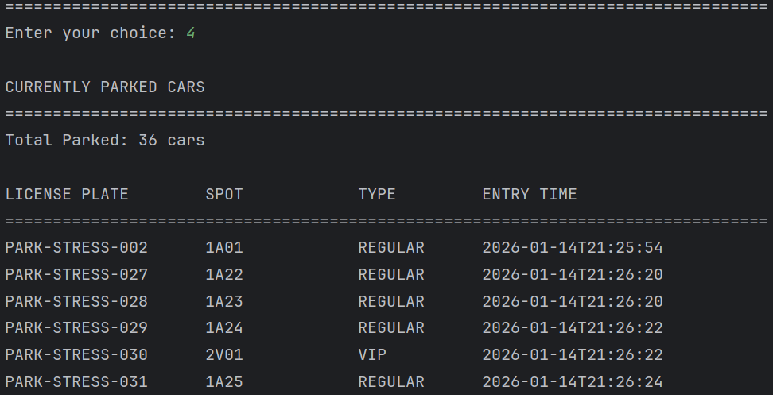

Real-time view showing:
- License plate numbers
- Assigned spot numbers
- Spot type (REGULAR/VIP)
- Entry timestamps

---

### Concurrent Entry Demo (10 Cars)
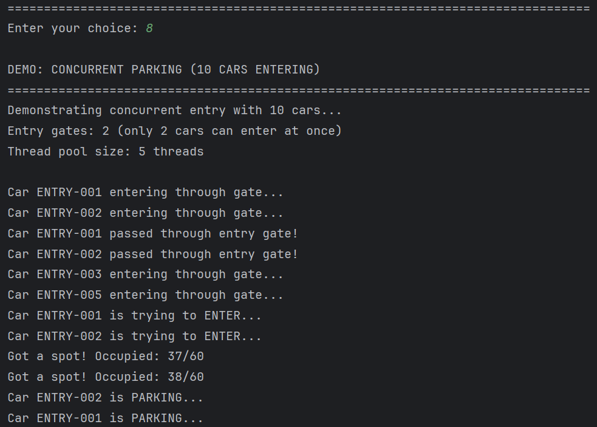

Demonstrates:
- 2 entry gates handling 10 concurrent cars
- Queue management (37/60, 38/60 occupancy)
- Thread pool coordination
- Realistic gate passage times

---

### Concurrent Exit Demo (5 Cars)
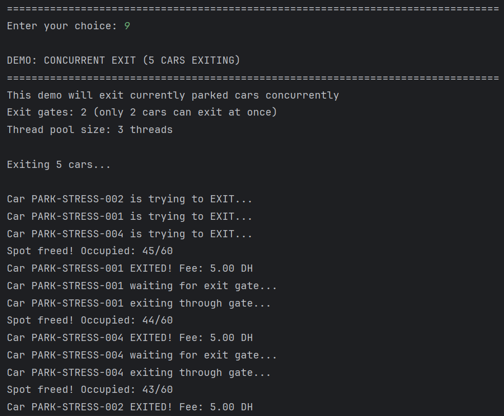

Shows:
- 2 exit gates processing 5 cars simultaneously
- Payment calculation (5.00 DH fee shown)
- Spot release notifications
- Queue updates (45→44→43 occupancy)


## 👨‍💻 Author

**Najim**

- GitHub: [@NAJIMx0](https://github.com/NAJIMx0)
- LinkedIn: [Najim Badr Eddine](https://www.linkedin.com/in/najim-badr-eddine/)

## 🙏 Acknowledgments

- Java Concurrency in Practice by Brian Goetz
- Effective Java by Joshua Bloch
- MySQL Documentation


## 📞 Support

For issues, questions, or contributions, please open an issue in the GitHub repository.

---

**Made with ☕ and Java**
